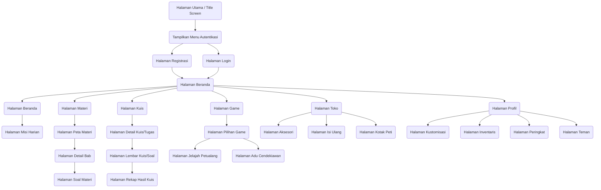

# 🗺️ Peta Navigasi Layar & Antarmuka Aplikasi (Screen Navigation Flowchart)

Dokumen ini memuat **Screen Navigation Flowchart** yang menggambarkan peta halaman dan menu yang ada di dalam aplikasi **Project Linimasa**. Diagram ini dibuat secara terpadu dalam satu flowchart besar untuk memberikan gambaran lengkap mengenai arsitektur informasi dan struktur navigasi layar (tanpa peran guru), murni memuat halaman/layar antarmuka saja tanpa logika internal pemrosesan data atau dialog pop-up.

---

## 1. Diagram Alur Teks (Copy-Pasteable ASCII)
```
                              Halaman Utama / Title Screen
                                           │
                                           ▼
                               Tampilkan Menu Autentikasi
                                           │
                           ┌───────────────┴───────────────┐
                           ▼                               ▼
                   Halaman Registrasi                Halaman Login
                           │                               │
                           └───────────────┬───────────────┘
                                           │ (Sukses Masuk)
                                           ▼
                                    Halaman Beranda
                                           │
     ┌──────────┬──────────┬───────────────┼───────────────┬──────────┐
     ▼          ▼          ▼               ▼               ▼          ▼
  Halaman    Halaman    Halaman         Halaman         Halaman    Halaman
  Beranda    Materi      Kuis            Game            Toko      Profil
     │          │          │               │               │          │
     ▼          ▼          ▼               │               │          ├──────────┬──────────┬──────────┐
  Halaman    Halaman    Halaman            │               │          ▼          ▼          ▼          ▼
  Misi       Peta       Detail             │               │       Halaman    Halaman    Halaman    Halaman
  Harian     Materi     Kuis/              │               │       Kustomi-   Inventa-   Pering-    Teman
                │       Tugas              │               │       sasi       ris        kat
                ▼          │               │               │
             Halaman       ▼               │               ├─────────────────────┬─────────────────────┐
             Detail     Halaman            │               ▼                     ▼                     ▼
             Bab        Lembar             │            Halaman               Halaman               Halaman
                │       Kuis               │            Aksesori              Isi Ulang             Kotak Peti
                ▼          │               ▼
             Halaman       ▼            Halaman
             Soal       Halaman         Pilihan
             Materi     Rekap            Game
                        Hasil              │
                                           ├───────────────────────┐
                                           ▼                       ▼
                                        Halaman                 Halaman
                                        Jelajah                 Adu
                                        Petualang               Cendekiawan
```

---

## 2. Diagram Alur Grafis (Mermaid JS)

