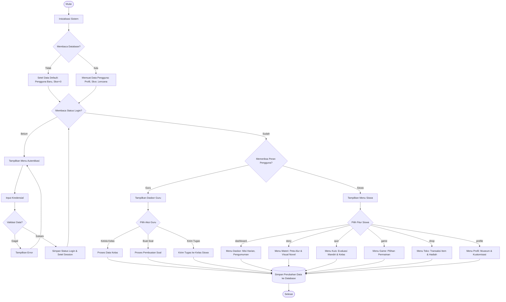
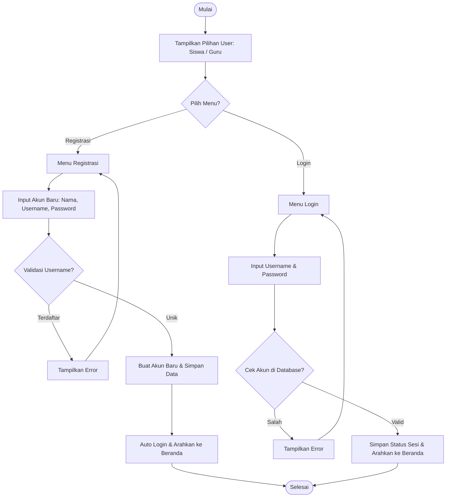
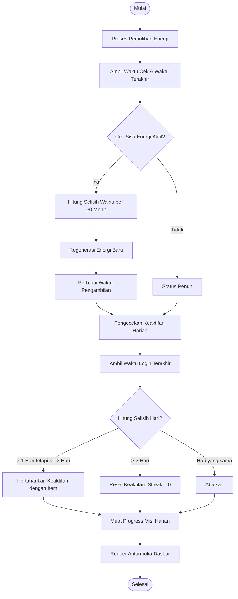
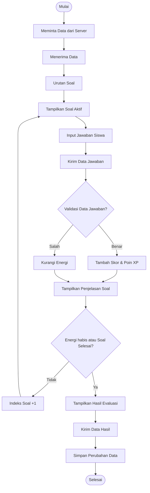
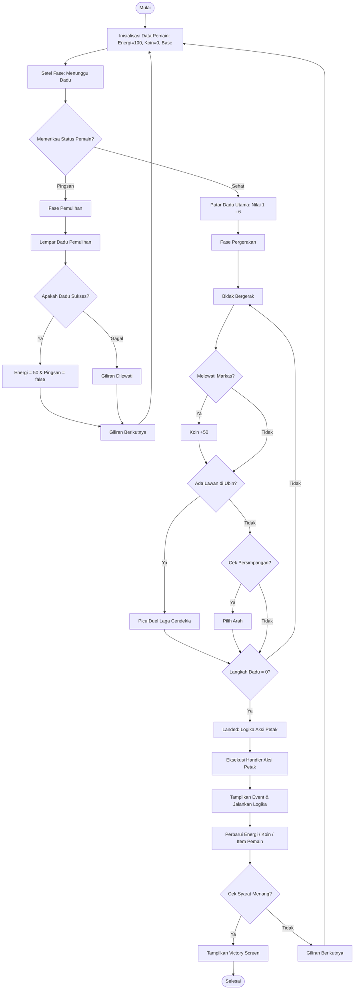
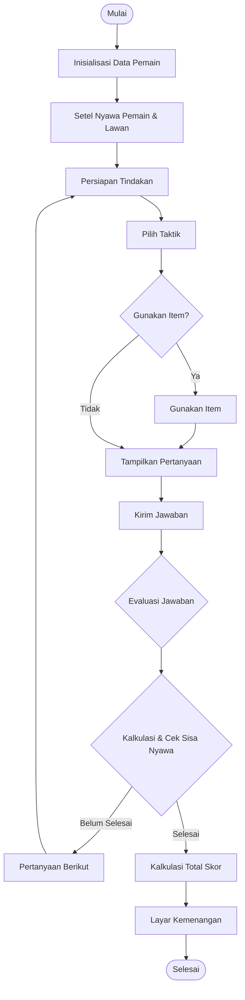
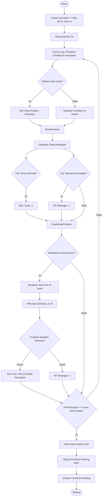
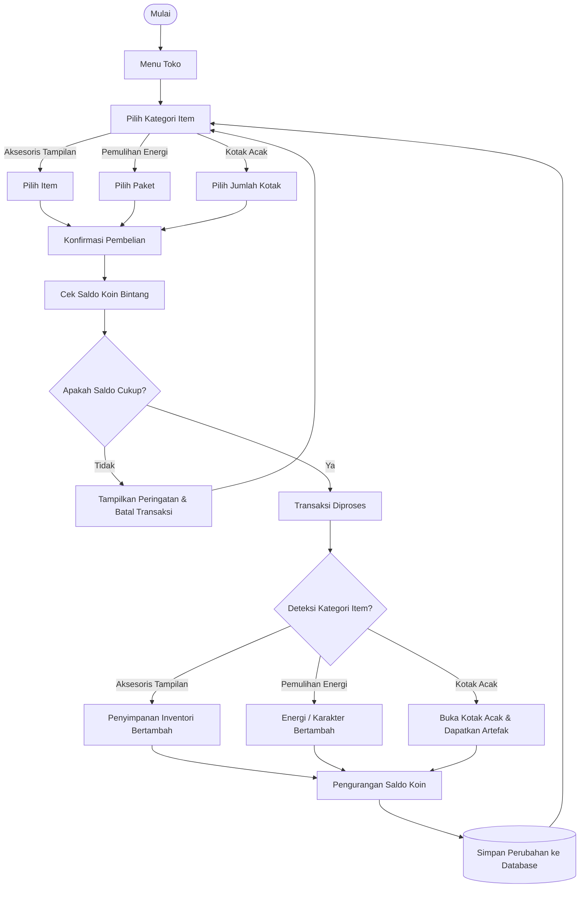
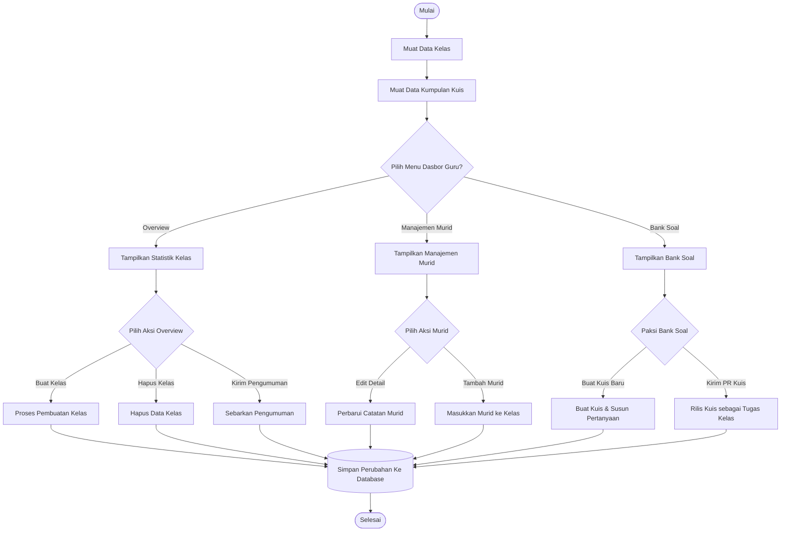
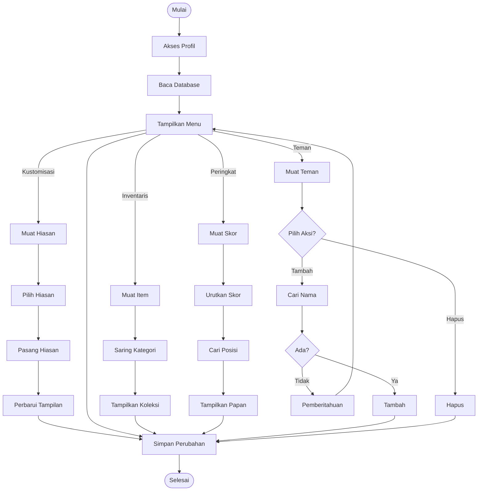

# 📊 Diagram Alur Sistem (System Flowchart) — Project Linimasa

Dokumen ini berisi rancangan **System Flowchart** (Diagram Alur Sistem) untuk seluruh modul aplikasi **Project Linimasa**. Berbeda dengan *User Flow* (yang hanya menggambarkan langkah navigasi pengguna), *System Flowchart* berfokus pada **bagaimana sistem memproses input, mengambil keputusan logis, melakukan manajemen data di memori, membaca/menulis ke media penyimpanan, dan menghasilkan output antarmuka**.

Setiap modul dilengkapi dengan dua format diagram:
1. **Diagram Alur Teks (ASCII/Unicode Box):** Format teks terstruktur menggunakan istilah sistem yang generik dan formal dalam bahasa Indonesia (tanpa referensi kode teknis), siap disalin-tempel (copy-paste) ke dalam dokumen Microsoft Word untuk penulisan **BAB IV Skripsi**.
2. **Diagram Alur Grafis (Mermaid JS):** Format grafis interaktif menggunakan istilah generik yang ter-render otomatis saat dibuka dengan Markdown Viewer.

---

## 1. ⚙️ Arsitektur Alur Sistem Global (Global System Flow)

Menggambarkan siklus hidup sistem dari saat aplikasi dijalankan, inisialisasi sistem, pemeriksaan data pada penyimpanan lokal, pemeriksaan status autentikasi, pembagian menu berdasarkan peran pengguna (Siswa/Guru), hingga pembaruan data secara persisten.

### A. Diagram Alur Teks (Copy-Pasteable)
```
                                  ( Mulai )
                                      │
                                      ▼
                             Inisialisasi Sistem
                                      │
                                      ▼
                             Membaca Database
                                      │
                      ┌───────────────┴───────────────┐
                      ▼ Ada                           ▼ Tidak Ada
               Memuat Data Pengguna            Setel Data Default
             (Profil, Skor, Lencana)          (Pengguna Baru, Skor=0)
                      │                               │
                      └───────────────┬───────────────┘
                                      ▼
                          Memeriksa Status Login
                                      │
                      ┌────────────────┴────────────────┐
                      ▼ Belum                         ▼ Sudah
             Tampilkan Menu Autoktifikasi       Memeriksa Peran Pengguna
                      │                               │
                      ▼                        ┌──────┴──────┐
              Input Kredensial                 ▼ Siswa       ▼ Guru
                      │                     Tampilkan      Tampilkan
                      ▼                     Menu Siswa    Dasbor Guru
               Validasi Data                   │              │
                      │                        ▼              ▼
               ┌──────┴──────┐             Pilih Fitur    Pilih Aksi
               ▼ Gagal       ▼ Sukses      (Materi, Kuis, (Kelola Kelas,
             Tampilkan     Simpan Status     Game, Toko)    Buat Soal)
               Error           Login           │              │
               │               │               └──────┬───────┘
               ▼               ▼                      │
            Ulangi       Setel Session                ▼
               │               │           Simpan Perubahan Data ke
               └───────────────┼─────────→         Database
                               │                      │
                               ▼                      ▼
                            Selesai                ( Selesai )
```

### B. Diagram Alur Grafis (Mermaid JS)


---

## 2. 🔐 Alur Sistem Modul Autentikasi (Authentication System Flow)

Memetakan logika pendaftaran akun baru dan verifikasi masuk dengan validasi multi-peran (Guru vs Siswa) serta perulangan jika kredensial salah.

### A. Diagram Alur Teks (Copy-Pasteable)
```
                                       Mulai
                                         │
                                         ▼
                               Tampilkan Pilihan User
                                   (Siswa / Guru)
                                         │
                         ┌───────────────┴───────────────┐
 ┌────────────────► Menu Registrasi                  Menu Login ◄──────────────────┐
 │                       │                               │                         │
 │                       ▼                               ▼                         │
 │              Input Akun Baru (Nama,            Input Username & Password         │
 │               Username, Password)                     │                         │
 │                       │                               ▼                         │
 │                       ▼                       Cek Akun di Database              │
 │                  Validasi Username                    │                         │
 │                       │                       ┌───────┴───────┐                 │
 │               ┌───────┴───────┐               ▼ Valid         ▼ Salah           │
 │               ▼ Terdaftar     ▼ Unik      Simpan Status Sesi Tampilkan Error    │
 │        Tampilkan Error    Buat Akun           │               │                 │
 │               │               │               ▼               ▼                 │
 │               ▼               ▼               │              Ulangi ─────────────┘
 │            Kembali       Simpan Data          │
 │               │               │               │
 └───────────────┘               ▼               │
                            Auto Login           │
                                 │               │
                                 ▼               ▼
                         Arahkan ke Beranda ◄────┘
                                 │
                                 ▼
                              Selesai
```

### B. Diagram Alur Grafis (Mermaid JS)


---

## 3. 🎓 Alur Sistem Dasbor Siswa & Pengecekan Streak

Modul yang berjalan secara otomatis untuk menghitung selisih waktu guna meregenerasi poin Energi (Nyawa) dan memperbarui status keaktifan beruntun (Streak).

### A. Diagram Alur Teks (Copy-Pasteable)
```
                              Akses Halaman Beranda
                                         │
                                         ▼
                             Panggil useHeartRegen
                                         │
                                         ▼
                            Cek Sisa Nyawa (Hearts)
                                         │
                        ┌────────────────┴────────────────┐
                        ▼ < 5                             ▼ = 5
               Hitung Selisih Waktu               Nyawa Tetap Penuh
            (Waktu Sekarang - LastRegen)                  │
                        │                                 │
                        ▼                                 │
               Regenerasi Nyawa                           │
               (Tiap 30 Menit = +1)                       │
                        │                                 │
                        └────────────────┬────────────────┘
                                         ▼
                             Pengecekan Streak Hari
                                         │
                        ┌────────────────┴────────────────┐
                        ▼ > 1 Hari                        ▼ <= 1 Hari
             Hitung Selisih Hari                  Streak Aktif
                        │                                 │
             ┌──────────┴──────────┐                      ▼
             ▼ <= 2 Hari           ▼ > 2 Hari        Pertahankan /
        Pertahankan Streak       Reset Streak        Tambah Streak
             (Gunakan Obor)         (Streak = 0)          │
             (Jika Diaktifkan)             │              │
             │                             │              │
             └──────────┬──────────────────┘              │
                        └────────────────┬────────────────┘
                                         ▼
                            Muat Misi Harian & Progres
                                         │
                                         ▼
                              Muat Pengumuman Guru
                                         │
                                         ▼
                             Render Tampilan Dasbor
                                         │
                                         ▼
                                     Selesai
```

### B. Diagram Alur Grafis (Mermaid JS)


---

## 4. 🧠 Alur Sistem Kuis Interaktif (Quiz Hub Engine)

Engine evaluasi pemahaman yang memproses permintaan soal ke server, memproses input jawaban siswa, melakukan validasi jawaban di server, dan mengirimkan hasil evaluasi kembali ke server.

### A. Diagram Alur Teks (Copy-Pasteable)
```
                                    Mulai Kuis
                                         │
                                         ▼
                             Meminta Data dari Server
                                         │
                                         ▼
                                   Menerima Data
                                         │
                                         ▼
                                    Urutan Soal
                                         │
                                         ▼
                               Tampilkan Soal Aktif ◄─────────────────────┐
                                         │                                │
                                         ▼                                │
                                Input Jawaban Siswa                       │
                                         │                                │
                                         ▼                                │
                               Kirim Data Jawaban                         │
                                         │                                │
                                         ▼                                │
                              Validasi Data Jawaban                       │
                                         │                                │
                        ┌────────────────┴────────────────┐               │
                        ▼ Benar                           ▼ Salah         │
                Tambah Skor & Poin XP              Kurangi Energi (-1 Nyawa)│
                        │                                 │               │
                        └────────────────┬────────────────┘               │
                                         ▼                                │
                             Tampilkan Penjelasan Soal                    │
                                         │
                        ┌────────────────┴────────────────┐               │
                        ▼ Energi > 0 & Soal Sisa          ▼ Energi habis /│
                        Indeks Soal +1                       Soal Selesai │
                        │                                         │       │
                        └─────────────────────────────────────────┼───────┘
                                                                  ▼
                                                          Hitung Skor Akhir
                                                                  │
                                                                  ▼
                                                           Kirim Data Hasil
                                                                  │
                                                                  ▼
                                                        Simpan Perubahan Data
                                                                  │
                                                                  ▼
                                                      Tampilkan Hasil Evaluasi
                                                                  │
                                                                  ▼
                                                             ( Selesai )
```

### B. Diagram Alur Grafis (Mermaid JS)


---

## 5. 🎲 Alur Sistem Game Papan 3D (Jelajah Nusantara Engine)

Mengendalikan logika giliran permainan papan, simulasi dadu, pergerakan bidak langkah-demi-langkah, penanganan petak peristiwa, pertempuran bidak, dan status pingsan (*fainted*).

### A. Diagram Alur Teks (Copy-Pasteable)
```
                                 Mulai Permainan
                                        │
                                        ▼
 ┌──────────────────────► Inisialisasi Data Pemain ◄────────────────────────────┐
 │                                      │                                       │
 │                                      ▼                                       │
 │                              Mulai Giliran Baru                              │
 │                                      │                                       │
 │                                      ▼                                       │
 │                           Memeriksa Status Pemain                            │
 │                                      │                                       │
 │                    ┌─────────────────┴─────────────────┐                     │
 │                    │ Energi = 0                        ▼ Energi > 0          │
 │                    │                            Putar Dadu Utama             │
 │                    │                              (Nilai 1 - 6)              │
 │                    ▼                                   │                     │
 │           Lempar Dadu Pemulihan                        ▼                     │
 │                    │                            Fase Pergerakan              │
 │                ┌───┴───┐                               │                     │
 │                ▼ Sukses▼ Gagal                         ▼                     │
 │                Energi +50 Giliran                Bidak Bergerak ◄────────┐   │
 │                          Lewat                         │                 │   │
 │                │       │                               ▼                 │   │
 │                └───┬───┘                     Melewati Markas Sendiri?    │   │
 │                    ▼                            ┌──────┴──────┐          │   │
 │            Giliran Berikutnya                   ▼ Ya          ▼ Tidak    │   │
 │                    │                         Koin +50   Ada Lawan di Ubin?   │
 └────────────────────┘                            │       ┌──────┴──────┐      │
                                                   │       ▼ Ya          ▼ Tidak│
                                                   │   Picu Duel   Cek Persimpangan?│
                                                   │  Laga Cendekia       │     │   │
                                                   │       │       ┌──────┴──────┐  │
                                                   │       │       ▼ Ya          ▼ Tidak
                                                   │       │   Pilih Arah     Lanjut│
                                                   │       │       │            │   │
                                                   └───────┼───────┴────────────┘   │
                                                           ▼                        │
                                                   Langkah Dadu = 0?                │
                                                           │                        │
                                                   ┌───────┴───────┐                │
                                                   ▼ Tidak         ▼ Ya             │
                                            Sisa Langkah -1      Landed             │
                                                   │               │                │
                                                   └───────────────┼────────────┐   │
                                                                   ▼            │   │
                                                           Logika Aksi Petak    │   │
                                                                   │            │   │
                                                                   ▼            │   │
                                                            Tampilkan Event     │   │
                                                                   │            │   │
                                                                   ▼            │   │
                                                           Cek Syarat Menang    │   │
                                                                   │            │   │
                                                   ┌───────────────┴───────┐    │   │
                                                   ▼ Ya                    ▼ Tidak  │
                                             Victory Screen       Giliran Berikutnya│
                                                   │                       │        │
                                                   ▼                       ▼        │
                                                Selesai           Giliran Berikutnya│
                                                                           │        │
                                                                           └────────┘
```

### B. Diagram Alur Grafis (Mermaid JS)


---

## 6. ⚔️ Alur Sistem Duel 1v1 (Adu Cendekiawan)

Duel kecerdasan 1v1 yang menggabungkan parameter atribut serangan/pertahanan/kelincahan karakter, pemilihan taktik aksi (Serang/Pulih), dan pengurangan poin Poin Nyawa.

### A. Diagram Alur Teks (Copy-Pasteable)
```
                                   Mulai Duel
                                         │
                                         ▼
                             Inisialisasi Data Pemain
                                         │
                                         ▼
  ┌─────────────────────────► Persiapan Tindakan
  │                                      │
  │                                      ▼
  │                             Tampilkan Pertanyaan
  │                                      │
  │                                      ▼
  │                                Kirim Jawaban
  │                                      │
  │                                      ▼
  │                               Evaluasi Jawaban
  │                                      │
  │                                      ▼
  │                           Kalkulasi & Cek Sisa Nyawa
  │                                      │
  │                      ┌───────────────┴───────────────┐
  │                      ▼ Belum Selesai                 ▼ Selesai
  │               Pertanyaan Berikut            Kalkulasi Total Skor
  │                      │                               │
  ┌──────────────────────┘                               ▼
                                                  Layar Kemenangan
                                                         │
                                                         ▼
                                                      Selesai
```

### B. Diagram Alur Grafis (Mermaid JS)


---

## 7. 🪂 Alur Sistem Game Mini Layangan (Flappy Kite Logic)

Loop simulasi fisika dinamis 2D (kecepatan vertikal & gravitasi) yang disisipi gerbang pertanyaan kuis interaktif selama penerbangan layangan.

### A. Diagram Alur Teks (Copy-Pasteable)
```
                                Mulai Layangan
                                       │
                                       ▼
                             Inisiasi Koordinat
                            (Y = 300, HP = 3, Skor = 0)
                                       │
                                       ▼
                             Hitung Mundur 3s
                                       │
                                       ▼
                                 Game Loop ◄──────────────────────────────────────┐
                                       │                                          │
                      ┌────────────────┴────────────────┐                         │
                      ▼                                 ▼                         │
              Terapkan Gravitasi              Deteksi Input Jump                  │
             (Kite jatuh kebawah)                (Layar diketuk)                  │
                      │                                 │                         │
                      │                                 ▼                         │
                      │                          Beri Gaya Keatas                 │
                      │                           (Kite melompat)                 │
                      │                                 │                         │
                      └────────────────┬────────────────┘                         │
                                       ▼                                          │
                             Gerakkan Tiang Pipa                                  │
                               (Kanan ke Kiri)                                    │
                                       │                                          │
                      ┌────────────────┴────────────────┐                         │
                      ▼                                 ▼                         │
             Cek Tabrakan Pipa                Cek Gerbang Kuis                    │
                      │                                 │                         │
            ┌─────────┴─────────┐              ┌────────┴────────┐                │
            ▼ Ya                ▼ Tidak        ▼ Ya              ▼ Tidak          │
         HP = HP - 1          Skor Tiang +1  Tampilkan Soal      Terbang Lanjut   │
            │                                  │                                  │
            ▼                                  ▼                                  │
      Cek HP = 0?                         Pilih Opsi Gerbang (A/B)                │
            │                                  │                                  │
            │                         ┌────────┴────────┐                         │
            │                         ▼ Benar           ▼ Salah                   │
            │                     Skor Kuis +20         HP = HP - 1               │
            │                         │                 │                         │
            │                         └────────┬────────┘                         │
            │                                  ▼                                  │
            │                             Cek HP = 0?                             │
            │                                  │                                  │
            └────────────────┬─────────────────┘                                  │
                             ▼                                                    │
                     HP = 0 / Nabrak Batas?                                       │
                             │                                                    │
                    ┌────────┴────────┐                                           │
                    ▼ Ya              ▼ Tidak                                     │
                Game Over          Lanjut Loop ───────────────────────────────────┘
                    │
                    ▼
              Hitung Bintang
             (Tambahkan ke Store)
                    │
                    ▼
                 Selesai
```

### B. Diagram Alur Grafis (Mermaid JS)


---

## 8. 🛒 Alur Sistem Transaksi Toko & Pembukaan Peti (Shop & Gacha)

Logika pemrosesan pengurangan saldo koin Bintang untuk membeli item aksesoris, pemulihan Energi, atau penukaran kotak peti misteri (gacha).

### A. Diagram Alur Teks (Copy-Pasteable)
```
                                   Menu Toko
                                       │
 ┌───────────────────────────► Pilih Kategori Item ◄─────────────────────────┐
 │                                     │                                     │
 │       ┌─────────────────────────────┼─────────────────────────────┐       │
 │       ▼                             ▼                             ▼       │
 │Aksesoris Tampilan           Pemulihan Energi                 Kotak Peti   │
 │       │                             │                             │       │
 │       ▼                             ▼                             ▼       │
 │  Pilih Item                    Pilih Paket               Pilih Jumlah Kotak│
 │       │                             │                             │       │
 │       └─────────────────────────────┼─────────────────────────────┘       │
 │                                     ▼                                     │
 │                            Konfirmasi Pembelian                           │
 │                                     │                                     │
 │                                     ▼                                     │
 │                          Cek Saldo Koin Bintang                           │
 │                                     │                                     │
 │                           ┌─────────┴─────────┐                           │
 │                           ▼                   ▼                           │
 │                      Saldo Cukup         Saldo Kurang                     │
 │                           │                   │                           │
 │                           ▼                   ▼                           │
 │                   Transaksi Diproses     Tampilkan Peringatan             │
 │                           │                       │                       │
 │       ┌───────────────────┼────────────────___┘                           │
 │       ▼                   ▼                   ▼                           │
 │  Penyimpanan           Energi/              Buka                          │
 │  Inventori            Karakter           Kotak Acak                       │
 │  Bertambah            Bertambah           (Artefak)                       │
 │       │                   │                   │                           │
 │       └───────────────────┼───────────────────┘                           │
 │                           ▼                                               │
 │                Pengurangan Saldo Koin                                     │
 │                           │                                               │
 └───────────────────────────┴───────────────────────────────────────────────┘
```

### B. Diagram Alur Grafis (Mermaid JS)


---

## 9. 👨‍🏫 Alur Dasbor Guru (Teacher Command Center System)

Memetakan tindakan administratif guru pengajar dalam mengelola kelas virtual, absensi murid, modul bank soal kuis, serta perilisan tugas pelajaran.

### A. Diagram Alur Teks (Copy-Pasteable)
```
                                Masuk Dasbor Guru
                                         │
                                         ▼
                             Muat Data Kelas & Kuis
                                         │
                                         ▼
                              Pilih Menu Dashboard
                                         │
         ┌───────────────────────────────┼───────────────────────────────┐
         ▼ Overview                      ▼ Manajemen Murid               ▼ Bank Soal
   Render Statistik Kelas          Render Rekap Absensi            Render Daftar Kuis
         │                               │                               │
    ┌────┴────┐                     ┌────┴────┐                     ┌────┴────┐
    ▼         ▼                     ▼         ▼                     ▼         ▼
  Buat      Kirim                 Edit      Tambah                Buat      Kirim PR
  Kelas  Pengumuman              Catatan    Siswa                 Kuis      ke Kelas
    │         │                     │         │                     │         │
    └────┬────┘                     └────┬────┘                     └────┬────┘
         └───────────────────────────────┼───────────────────────────────┘
                                         ▼
                             Simpan Update ke Store
                                         │
                                         ▼
                               Simpan ke Database
                                         │
                                         ▼
                                Selesai / Re-render
```

### B. Diagram Alur Grafis (Mermaid JS)


---

## 10. 👤 Alur Sistem Halaman Profil (Profile & Customization System Flow)

Memetakan bagaimana sistem memuat profil pengguna dan menangani empat aksi utama: kustomisasi tampilan dengan hiasan terpasang, pemetaan inventaris item/penghargaan, pengurutan papan peringkat, serta penambahan atau penghapusan daftar teman.

### A. Diagram Alur Teks (Copy-Pasteable)
```
                                 Akses Profil
                                      │
                                      ▼
                                Baca Database
                                      │
                                      ▼
                                Tampilkan Menu
                                      │
         ┌───────────────────┬────────┴────────┬───────────────────┐
         ▼                   ▼                 ▼                   ▼
    Kustomisasi          Inventaris        Peringkat             Teman
         │                   │                 │                   │
         ▼                   ▼                 ▼                   ▼
    Muat Hiasan          Muat Item         Muat Skor           Muat Teman
         │                   │                 │                   │
         ▼                   ▼                 ▼                   ├──────────┐
    Pilih Hiasan      Saring Kategori      Urutkan Skor            ▼          ▼
         │                   │                 │                Tambah      Hapus
         ▼                   ▼                 ▼                 Teman      Teman
    Pasang Hiasan        Tampilkan        Cari Posisi              │          │
         │                Koleksi              │                   ▼          ▼
         ▼                   │                 ▼               Cari Nama    Hapus
     Perbarui                │             Tampilkan               │          │
     Tampilan                │               Papan                 ▼          │
         │                   │                 │                 Ada?         │
         │                   │                 │                ┌──┴──┐       │
         │                   │                 │                ▼ Ya  ▼ Tidak │
         │                   │                 │             Tambah   Pemberi-│
         │                   │                 │               │      tahuan  │
         │                   │                 │               │        │     │
         └───────────────────┼─────────────────┼───────────────┴────────┼─────┘
                             ▼                 ▼                        │
                              Simpan Database ◄─────────────────────────┘
                                      │
                                      ▼
                                   Selesai
```

### B. Diagram Alur Grafis (Mermaid JS)


---

*Dokumen System Flowchart ini dibuat sebagai referensi mutlak arsitektur sistem logika aplikasi **Project Linimasa**.*
